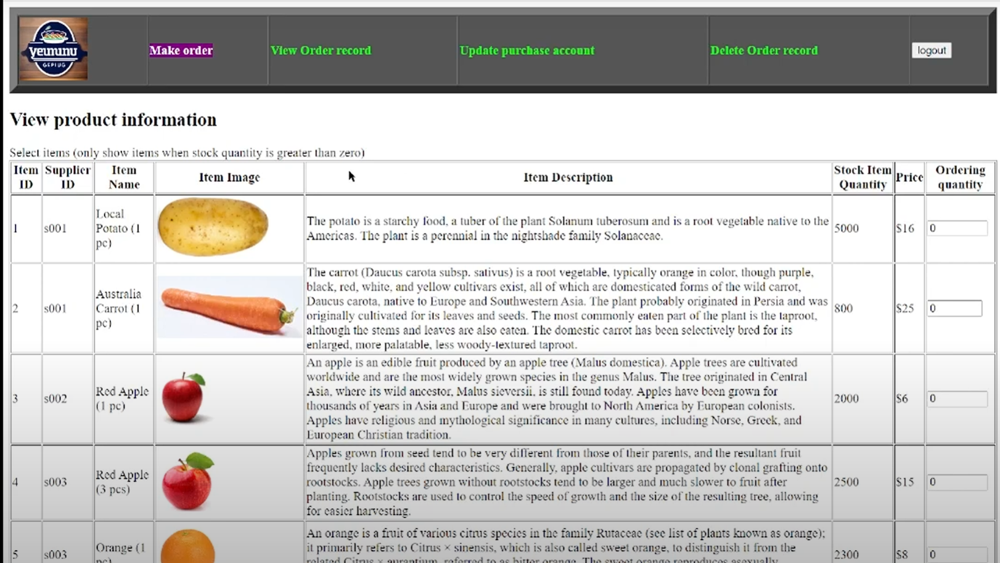
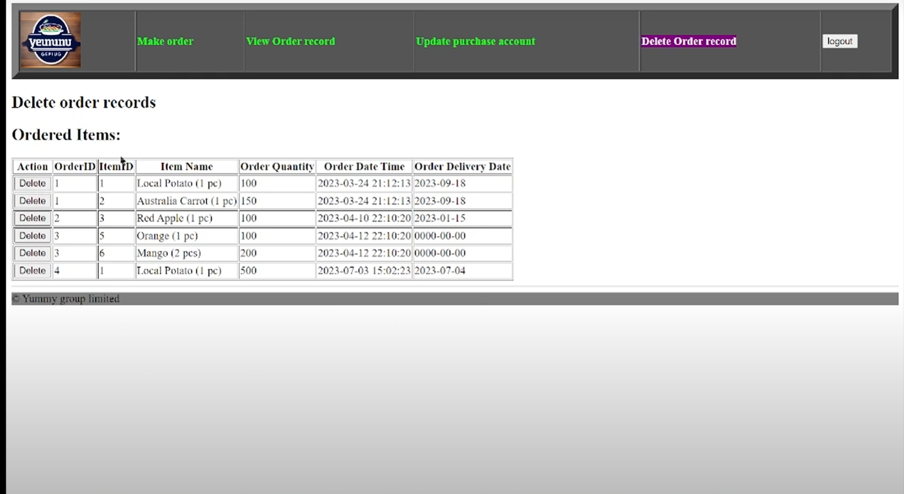
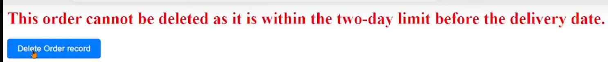

# ITP4523M Assignment

## Table of Contents
- [Introduction](#introduction)
- [Objectives](#objectives)
- [User Roles](#user-roles)
- [Purchase Manager Features](#purchase-manager-features)
  - [Order Management](#order-management)
  - [View Order Records](#view-order-records)
  - [Update Information](#update-information)
  - [Delete Order Record](#delete-order-record)
- [Python Plug-in: Discount Calculator](#python-plug-in-discount-calculator)
  - [Introduction](#introduction-1)
  - [API Usage](#api-usage)
  - [Discount Calculation](#discount-calculation)
- [Areas for Improvement](#areas-for-improvement)

## Introduction
This document outlines the end-of-module assignment for the ITP4523M module (Internet & Multimedia Applications Development) for the 22/23 academic year. Due to the departure of my project partner, I focused solely on developing the Purchase Manager component of the project.

## Objectives
The primary goals of this project are to:
- Build a web application that provides various functions for both Purchase Managers and Suppliers.
- Develop a user-friendly, interactive, robust, and maintainable website using skills learned in this module, including HTML, CSS, JavaScript, PHP, SQL, and Python.

## User Roles
The Management System supports two user roles:
- **Purchase Manager**: Responsible for placing orders and retrieving order records.
- **Supplier**: Manages their own items within the system.

## Purchase Manager Features

### Order Management
- **Create Orders**: The Purchase Manager can place orders for items provided by suppliers, entering all necessary information.
- **Product Information**: Users can easily select items from different suppliers, with only items in stock (quantity greater than zero) displayed.
  
<p align="center">
  
</p>

- **Automatic Order ID Generation**: Each order is assigned a unique order ID automatically by the system.
- **Stock Updates**: The system updates the stock item quantity after an order is created.

### View Order Records
- **Order Records**: The Purchase Manager can view all order records with essential information.
- **Grouping and Sorting**: Orders can be grouped by supplier and sorted by at least two columns, as selected by the user.

### Update Information
- **Manage Profile**: The Purchase Manager can update their information, including:
  1. Password
  2. Contact Number
  3. Warehouse Address

### Delete Order Record
- **Order Deletion**: The Purchase Manager can delete an order record from the Orders table and related records in the OrdersItem table.
  <p align="center">
  
</p>


- **Stock Updates**: The system updates the stock item quantity after an order is deleted.
- **Confirmation Prompt**: A confirmation message is displayed to confirm the deletion of an order.
  <p align="center">
  
</p>


- **Deletion Policy**: Orders can only be deleted if they are at least two days before the scheduled delivery date.

## Python Plug-in: Discount Calculator

### Introduction
This Python Flask application serves as a discount calculator, providing discount rates and new order amounts based on the total order amount. 

### API Usage
- **URL Request**: `/api/discountCalculator`
- **Input Parameter**:
  - `TotalOrderAmount` (float): The total amount of the order.
- **Response Format (in JSON)**:
  ```json
  {
    "DiscountRate": ________,
    "NewOrderAmount": ________
  }
  ```

### Discount Calculation
The discount rate is determined based on the following criteria:

| Total Order Amount | Discount Rate |
| ------------------ | ------------- |
| ≥ $10,000          | 13%           |
| ≥ $5,000           | 6%            |
| ≥ $3,000           | 3%            |
| Default            | 0%            |

## Areas for Improvement
Based on feedback received, several areas for future enhancement include:

1. **User Interface Design**: Improving the visual appeal and overall user experience of the web application.
2. **Prompt Messages**: Implementing warning messages for incorrect password entries and requiring password confirmation for sensitive updates.
3. **Display Discounted Price**: Adding a transition page to show selected items and discounted prices during checkout.
4. **Code Readability**: Enhancing code comments to improve readability and understanding for future developers.

These suggestions aim to further enhance the project, making it more
